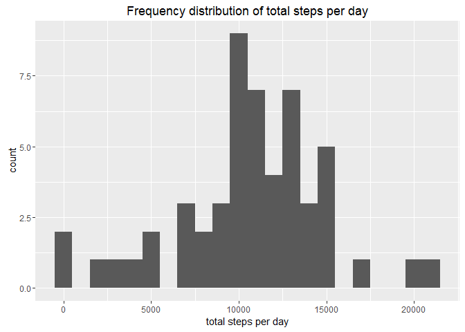
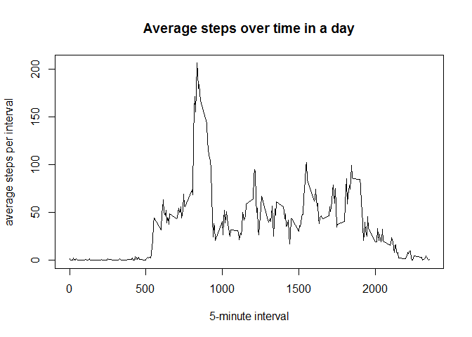
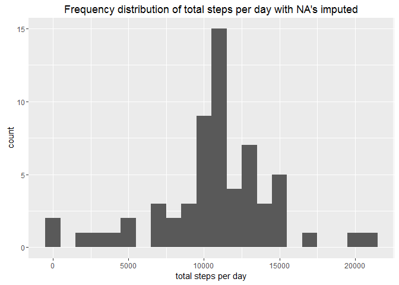
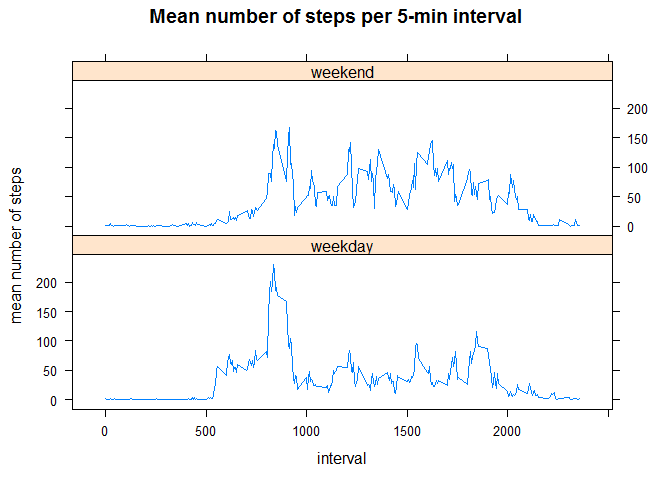

# Reproducible Research: Peer Assessment 1


## Loading and preprocessing the data


```r
      library("tidyverse")
```

```
## Warning: package 'tidyverse' was built under R version 3.2.5
```

```
## Loading tidyverse: ggplot2
## Loading tidyverse: tibble
## Loading tidyverse: tidyr
## Loading tidyverse: readr
## Loading tidyverse: purrr
## Loading tidyverse: dplyr
```

```
## Warning: package 'ggplot2' was built under R version 3.2.4
```

```
## Warning: package 'tibble' was built under R version 3.2.5
```

```
## Warning: package 'tidyr' was built under R version 3.2.5
```

```
## Warning: package 'readr' was built under R version 3.2.5
```

```
## Warning: package 'purrr' was built under R version 3.2.5
```

```
## Warning: package 'dplyr' was built under R version 3.2.5
```

```
## Conflicts with tidy packages ----------------------------------------------
```

```
## filter(): dplyr, stats
## lag():    dplyr, stats
```

```r
      library(readr)
      activity <- read_csv("C:/Users/beukesp/Dropbox/Coursera/Module 5 - Reproducible research/Week 2/RepData_PeerAssessment1-master/RepData_PeerAssessment1-master/activity/activity.csv")
```

```
## Parsed with column specification:
## cols(
##   steps = col_integer(),
##   date = col_date(format = ""),
##   interval = col_integer()
## )
```


## What is mean total number of steps taken per day?

```r
      days <- group_by(activity, date)
      total_steps <- summarise(days, sum(steps))
```


```r
      qplot(`sum(steps)`, data = total_steps, geom = "histogram",
      binwidth = 1000, xlab="total steps per day", 
      main="Frequency distribution of total steps per day")
```

```
## Warning: Removed 8 rows containing non-finite values (stat_bin).
```

<!-- -->


```r
      mean_steps <- mean(total_steps$`sum(steps)`,na.rm=TRUE)
      median_steps <- median(total_steps$`sum(steps)`,na.rm=TRUE)
      mean_steps
```

```
## [1] 10766.19
```

```r
      median_steps
```

```
## [1] 10765
```
The mean total number of steps taken per day is 1.0766189\times 10^{4}

## What is the average daily activity pattern?

```r
      noNA_data <- filter(activity,!is.na(steps))
      interval_data <- select(noNA_data, steps, interval)
      interval_grouped <- group_by(interval_data, interval)
      steps_per_interval <- summarise(interval_grouped, mean(steps))
      with(steps_per_interval,plot(x=interval,y=`mean(steps)`,type="l",
            xlab="5-minute interval",ylab="average steps per interval",
            main="Average steps over time in a day"))
```

<!-- -->

```r
      max_steps <- steps_per_interval %>% filter(`mean(steps)`==max(`mean(steps)`))
      max_steps
```

```
## # A tibble: 1 × 2
##   interval `mean(steps)`
##      <int>         <dbl>
## 1      835      206.1698
```

The 5-min interval across all days that has the highest number of steps is around 8:35 am in the morning

## Imputing missing values
The total number of missing values in the data set


```r
      NA_data <- filter(activity,is.na(steps))
      NA_obs <- nrow(NA_data)
      NA_obs
```

```
## [1] 2304
```

A strategy of imputing missing values


```r
      activity2 <- merge(activity,steps_per_interval,by.x="interval",all=TRUE)
      activity2$newsteps <- ifelse(is.na(activity2$steps), activity2$`mean(steps)`,activity2$steps)
```

A histogram with imputed missing values


```r
      days2 <- group_by(activity2, date)
      total_steps2 <- summarise(days2, sum(newsteps))
      qplot(`sum(newsteps)`, data = total_steps2, geom = "histogram",
            binwidth = 1000, xlab="total steps per day", 
            main="Frequency distribution of total steps per day with NA's imputed")
```

<!-- -->


```r
      mean_steps2 <- mean(total_steps2$`sum(newsteps)`)
      median_steps2 <- median(total_steps2$`sum(newsteps)`)
      mean_steps2
```

```
## [1] 10766.19
```

```r
      median_steps2
```

```
## [1] 10766.19
```

The mean total number of steps per day with imputed values for missing data is 1.0766189\times 10^{4},which is exactly the same as the original value of 1.0766189\times 10^{4} where missing values were removed. The impact of imputing missing data was minimal. 

## Are there differences in activity patterns between weekdays and weekends?


```r
      activity2$day <- weekdays(as.Date(activity2$date))
      activity2$weekend <- ifelse(activity2$day %in% c("Saturday","Sunday"),"weekend","weekday")
      
      interval_data2 <- select(activity2, interval,newsteps,weekend)
      interval_grouped2 <- group_by(interval_data2, weekend,interval)
      steps_per_interval2 <- summarise(interval_grouped2, mean(newsteps))
      View(steps_per_interval2)

      library(lattice)
      xyplot(`mean(newsteps)`~interval|as.factor(weekend),steps_per_interval2,type="l",
             layout=c(1,2),main="Mean number of steps per 5-min interval",
                                 ylab="mean number of steps")
```

<!-- -->

The plots clearly show differences in activity patterns between weekdays and weekends
